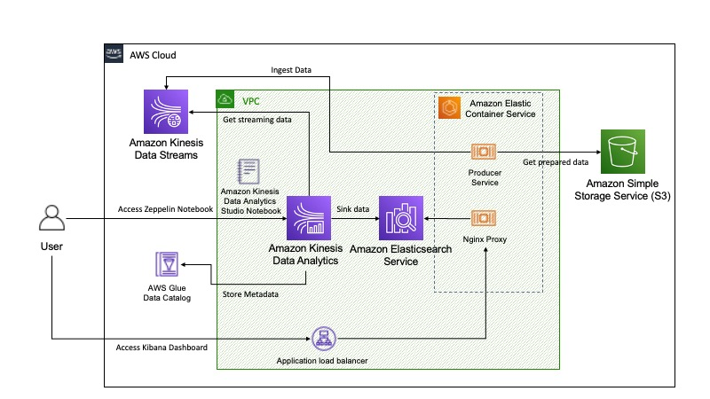
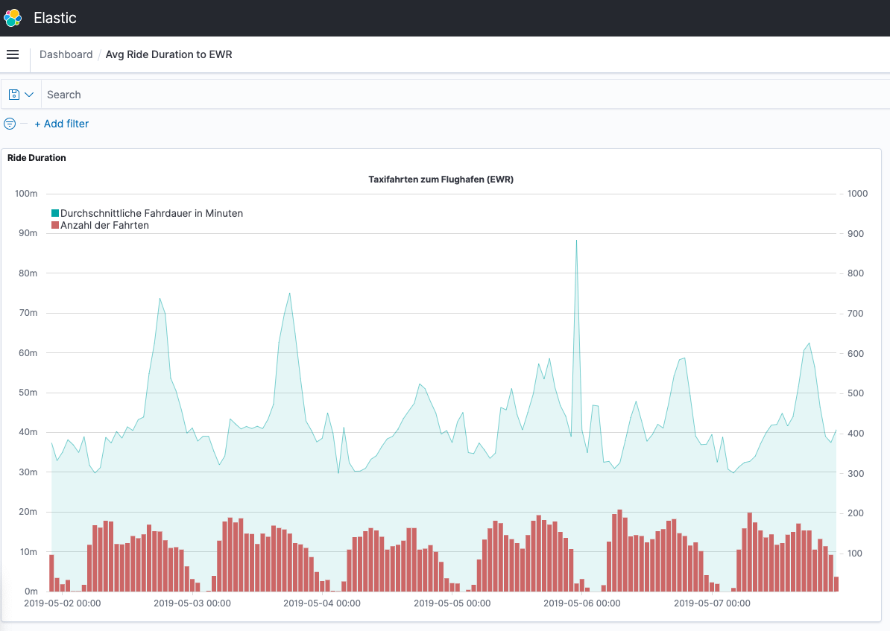

# Low-code real-time analytics with Apache Flink SQL

This sample provides sample code on how to run Apache Flink SQL on Amazon Kinesis Data Analytics Studio. For analysis purposes the TLC Taxi Dataset is used.

## Architecture



## Infrastructure Setup

:warning: **This sample only works in the N. Virgina (us-east-1) region**

### Deploy infrastructure on AWS
Clone the repository and navigate to the `cdk` directory.

This project is set up like a standard Python project.  The initialization
process also creates a virtualenv within this project, stored under the `.venv`
directory.  To create the virtualenv it assumes that there is a `python3`
(or `python` for Windows) executable in your path with access to the `venv`
package. If for any reason the automatic creation of the virtualenv fails,
you can create the virtualenv manually.

To manually create a virtualenv on MacOS and Linux:

```
python3 -m venv .venv
```

After the init process completes and the virtualenv is created, you can use the following
step to activate your virtualenv.

```
source .venv/bin/activate
```

If you are a Windows platform, you would activate the virtualenv like this:

```
.venv\Scripts\activate.bat
```

Once the virtualenv is activated, navigate to the cdk directory and install the required dependencies.
```
cd cdk
```
```
pip install -r requirements.txt
```
To bootstrap CDK resources run the following command

```
cdk bootstrap
```

At this point you can now synthesize the CloudFormation template for this code.

```
cdk synth --quiet
```
To deploy run the infrastructure run the following command. 

```
cdk deploy --require-approval never
```

### Configure Kinesis Analytics Studio

1. Configure VPC

Navigate to the Amazon Kinesis Console, choose Analytics Applications > Studio. Choose the studio that was created, 
switch to Configuration.
Edit the Network Configuration with the following parameters:
- VPC: `FlinkSQLDemoStack`
- Subnets: `FlinkSqlDemoStack/streamingVPC/PublicSubnet1` & `FlinkSqlDemoStack/streamingVPC/PublicSubnet2`
- Security Group: `FlinkSqlDemoStack-kdaSG`

2. Configure Connectors

Edit the AWS supported connectors section, tick the row `amazon-kinesis-sql-connector-flink` and hit save.
After saving click Add custom connector, choose the S3 bucket named `flinksqldemostack-kdaconnectorsbucket` and define 
`flink-sql-connector-elasticsearch7_2.11-1.11.2.jar`as Path.

Edit the AWS Supported connectors section. Tick `amazon-kinesis-sql-connector-flink` and click Save Changes.

Start the Notebook by clicking `Run`.


### Create Elasticsearch Indices

Set Elasticsearch endpoint as environment variable. Get the ServiceURL from the CDK Output after cdk deploy has been run.
Replace the http endpoint with your own. Make sure you use HTTP protocol.
```shell script
export ES_ENDPOINT = http://Flink-esPro-xxxxxxxxxxxx-xxxxxxxxxx.us-east-1-elb.amazon.com
```

#### Trip Duration Time

```shell script
curl --location --request PUT ${ES_ENDPOINT}/trip_duration \
--header 'Content-Type: application/json' \
--data-raw '{
  "mappings": {
    "properties": {
        "PULocationID": {"type": "integer" },
        "avg_trip_duration": {"type": "integer"},
        "window_start": {"type": "date", "format": "yyyy-MM-dd HH:mm:ss"} }
    }
  }
}'
```

## Analysis

In the Kinesis Data Anyaltics console select the created Notebook and click `Open in Apache Zeppelin`. Create a new note
and run these commands in a the Amazon Kinesis Data Analytics Studio Notebook. Execute each statement.
Navigate to Amazon Kinesis Console, select Studio and Run the Notebook. Create a new File and use the following commands.
1. Create Streaming Data Table
    
    Replace the `STREAM_NAME` variable with the Kinesis stream name CDK created for you. You can find it in the Kinesis Console or Cloudformation output.
    ```sql
    %flink.ssql
    
    CREATE TABLE ride_events (
        tpep_pickup_datetime TIMESTAMP(3),
        tpep_dropoff_datetime TIMESTAMP(3),
        PULocationID INTEGER,
        DOLocationID INTEGER,
        WATERMARK FOR tpep_pickup_datetime AS tpep_pickup_datetime - INTERVAL '5' SECOND
    )
    WITH (
        'connector' = 'kinesis',
        'stream' = 'STREAM_NAME',
        'aws.region' = 'us-east-1',
        'scan.stream.initpos' = 'LATEST',
        'format' = 'json',
        'json.timestamp-format.standard' = 'SQL'
    );
    ```
    Execute the cell with `Shift + Return`.

2. Create Elasticsearch Sink
    
    Insert a new cell below by pressing ESC followed by `Ctrl + Alt + b`.
    Replace the ES_VPC_ENDPOINT variable in the following statement with your own ES endpoint. You can find it ine the Amazon OpenSearch console or the CloudFormation output.
    ```sql
    %flink.ssql
    
    CREATE TABLE trip_duration (
        PULocationID INTEGER,
        avg_trip_duration BIGINT NOT NULL,
        window_start TIMESTAMP(3)
    ) WITH (
        'connector' = 'elasticsearch-7',
        'hosts' = 'http://ES_VPC_ENDPOINT:80',
        'index' = 'trip_duration'
    );
    ```
    Execute the cell with `Shift + Return`.

3. Analyze Streaming Data
    
    Insert a new cell below by pressing ESC followed by `Ctrl + Alt + b`.
    ```sql
    %flink.ssql(type=update)
    
    INSERT INTO trip_duration(
        SELECT PULocationID,
            AVG(UNIX_TIMESTAMP(CAST(tpep_dropoff_datetime AS STRING)) - UNIX_TIMESTAMP(CAST(tpep_pickup_datetime AS STRING))) AS avg_ride_duration,
            TUMBLE_START(tpep_pickup_datetime, INTERVAL '60' minute) AS window_start 
        FROM ride_events
        WHERE TIMESTAMPDIFF(HOUR,tpep_pickup_datetime, tpep_dropoff_datetime) <= 4 
        GROUP BY TUMBLE(tpep_pickup_datetime, INTERVAL '60' minute), PULocationID
    )
    
    ```
    Execute the cell (`Shift + Return`). This will start the analytics application. If you want to deploy to KDA follow step 4.

4. Deployment to Amazon Kinesis Data Analytics (optional)

On the top right click Actions and then `Build`. Wait until the a green box appears and then click `Deploy`.


### Kibana Dashboard

Get the Kibana URL from the CDK Output or CFN Output.
Create an Index Pattern by navigating to Stack Management / Index Patterns. Define the index pattern name `trip_duration`.
Click next and select `window_start` as time field.

In the Kibana Dashboard navigate to Stack Management / Save Objects. Import the file dashboard.json from the repo.

If you are not able to access Kibana check the Security Group Settings of your nginx Proxy.

View the visuals in the Dashboard section.



## Cleanup

To remove any AWS resources deployed in this sample run the following command:

```shell script
cdk destroy
```

Remove any remaining resources manually in the AWS console.

## Security

See [CONTRIBUTING](CONTRIBUTING.md#security-issue-notifications) for more information.

## License

This library is licensed under the MIT-0 License. See the LICENSE file.
